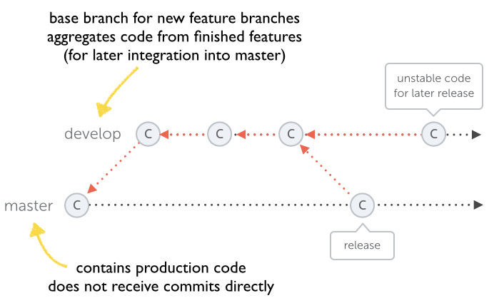

# Git Flow

## Branching Model

在 git flow 中有两个重要的分支，master 分支以及 develop 分支。

master 分支只应该存有生产环境的代码。我们不应该直接在 master 分支上进行开发，而是应该在其它特定的分支上进行开发。所以不应该存在直接向 master 分支 commit 代码的情况。

develop 分支是所有新功能开发的基础分支，当我们需要添加一个新的 feature 的时候，应该基于 develop 分支创建一个新的 feature 分支。develop 分支应用于汇总所有已完成的 feature 代码，这些代码等待着被合并到 master 分支上。

master 以及 develop 分支称之为长期分支，这两个分支在整个项目生命周期中一直存在。其它分支，如 features 和 releases 分支则只会短暂的存在：它们按需创建，并且在完成了任务之后被删除。

## Feature Development

使用单独的分支用于功能开发，是版本管理中一个很重要的原则。

在开发新功能时，应基于 develop 分支创建新的分支，feature 分支名称应以 'feature/' 作为前缀。如要开发一个 RSS 订阅的功能，那么该 feature 分支的命名应为 'feature/rss-feed'。

新功能开发完毕后，就应该将 feature 分支合并到 develop 分支中。feature 分支合并到 develop 分支后，就可以将 feature 分支删除。随后应在 develop 分支中对新添加的 feature 进行全面的测试。

当 develop 分支积累一定数量的 feature，就可以将 develop 分支合并到 master 分支了。

## Managing Releases

当 develop 分支满足下面的条件时，则表示 develop 分支已经可以用于发布新的 release：

1. 它包含了一定数量的 features 以及必要的修复。
2. 经过了全面的测试。

release 分支基于 develop 分支进行创建。其名称前缀为 'release/'，后紧跟版本号，如 'release/1.1.5'。当有了 release 分支只有，就可以做一些最后的调整，如软件的版本号可能是在配置文件中设置的，这时候就可以更改版本号了。

1. 从远程 release 分支中拉取代码，确保本地 release 分支的代码是最新的。
2. 将 release 分支合并到 master 分支以及 develop 分支。
3. 为了以后轻松识别，给最后的 release 分支的 commit 打一个 tag。
4. 删除 release 分支。

## Hotfixes

尽管对 release 版本进行过全面的测试，但软件上线后仍然很可能会出现一些小 Bug。这时候就应该基于 master 分支创建 hotfix 分支进行 bug 修复。hotfix 分支的名称前缀为 'hotfix/'，例如修复缺少链接的 bug，则 hotfix 分支的名称为 'hotfix/missing-link'。

当 hotfix 完毕之后，有几样事情需要做：

1. 将 hotfix 分支合并到 master 分支以及 develop 分支。
2. 为该 hotfix 打上 tag。
3. 将 hotfix 分支删除。
4. 对 master 分支进行打包。
