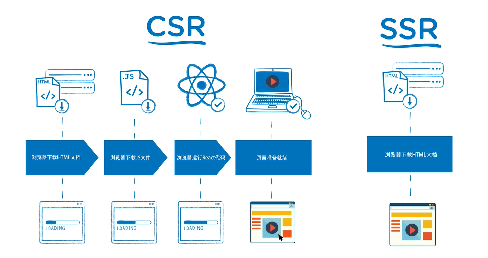

# 服务器端渲染(SSR)与客户端渲染(CSR)

## 服务器端渲染

浏览器上显示的内容由服务器生成好，然后传给浏览器显示出来，这种方式就叫做服务器端渲染。

## 客户端渲染

而客户端渲染最典型的例子就是使用 `create-react-app` 创建的应用了。当我们审查页面源码的时候，其实并没有我们页面上显示的内容的。也就是说，服务器给我们返回的仅仅只是一个 HTML 结构框架，剩下的所有内容都是通过 JS 来产生。

### 优势

客户端渲染，其 react 代码仅负责页面的渲染，而后端通过接口向前端提供数据，这样就实现了前后端分离的架构。在团队开发的过程中，这种前后端分离的架构体系，会给我们开发的效率带来巨大的提升。

### 弊端

#### 弊端一：首屏加载速度慢

上面的图片中，左侧是 CSR 的流程，右侧则是 SSR 的流程。

如果使用 SSR，用户在请求一个页面的时候，只需要下载一个 HTML 文档，内容就能直接渲染到页面上。

但是如果使用 CSR，用户在请求一个页面的时候，需要先下载一个 HTML 文档，这个HTML 文档是空的。下载完页面之后，继续下载 JS 文件，然后浏览器运行 React 代码，React 代码渲染渲染页面，最后才将页面呈现给用户。

CSR 与 SSR 对比，其首屏加载速度是比较慢的。CSR 用户第一次看到页面的速度是比 SSR 用户第一次看到页面的速度是要慢的。因此 SSR 的用户体验更好一些。

#### 弊端二：SEO 效果差

SEO 即 search engine optimization（搜索引擎优化），一般的搜索引擎它的爬虫可能只认 HTML 中的内容，而不能识别 JS 中的内容，因此 CSR react 应用在 SEO 上面就会有很大的劣势。
