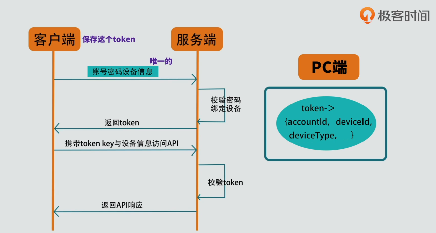
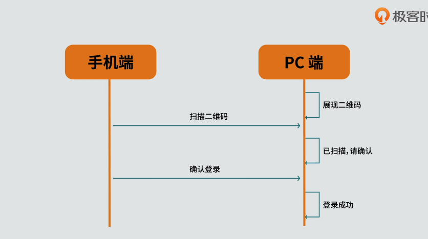
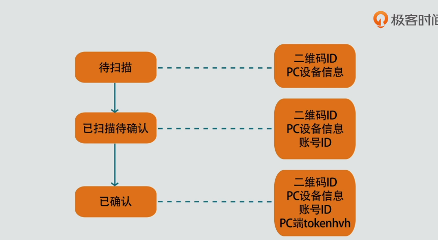
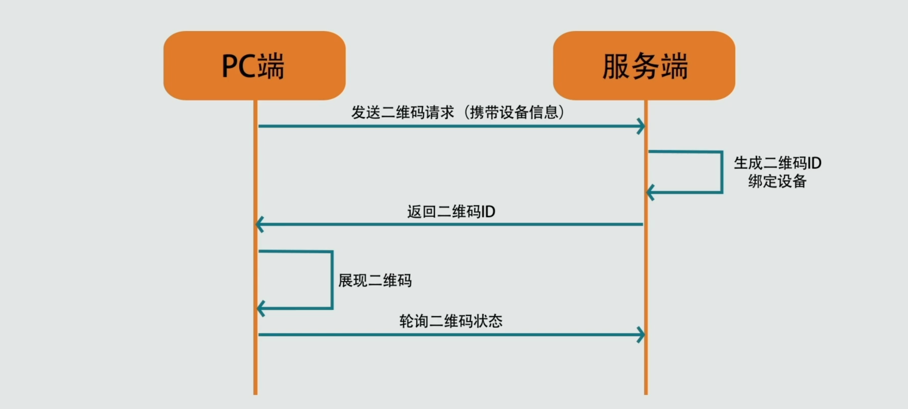
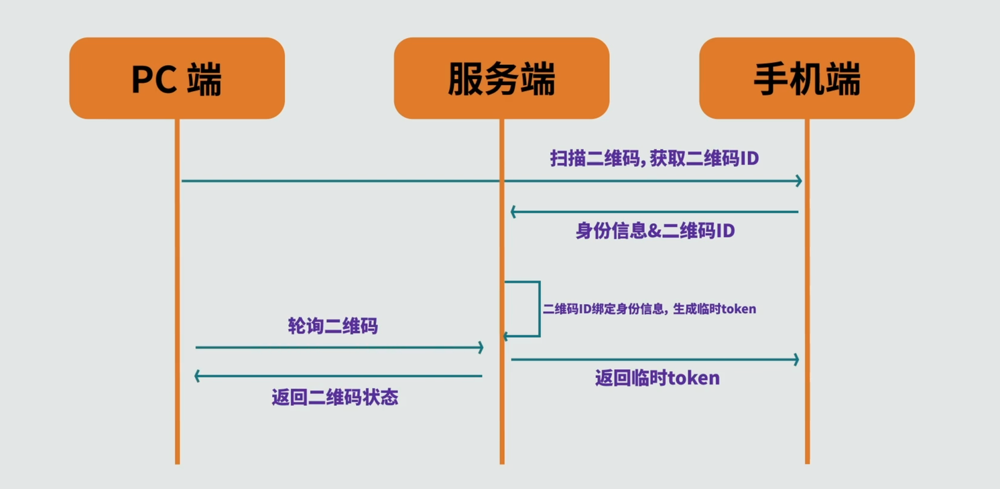

# 二维码扫描登录原理

二维码最常用的场景之一，就是通过手机端来扫描 PC 或者 Web 端的二维码，来登录同一个系统。例如手机微信扫码登录 PC 端微信、手机淘宝扫码登录 Web 端淘宝。

## 二维码

在了解二维码之前，先了解一下一维码。一维码，就是我们在商品上看到的条形码。条形码实际上就是一串数字，它在上面存储了商品的序列号。

二维码其实与一维码非常类似，只不过它存储的不只是数字，还可以是任何的字符串。例如我们可以生成代表某些文字的二维码。一个二维码实际上就是一个字符串，我们可以简单地认为二维码就是字符串的另外一种表现形式。

## 二维码登录本质

二维码登录本质上也是一种登录认证方式。既然是认证登录，要做的其实就两件事：

1. 告诉系统我是谁。
1. 向系统证明我是谁。

如账号密码登录，账号就是告诉系统我是谁，而密码就是证明我是谁。如手机验证码登录，手机号就是告诉系统我是谁，而验证码就是验证我是谁。

扫码登录是如何做到“告诉系统我是谁”以及“向系统证明我是谁”这两件事的？

### 告诉系统我是谁

手机端应用扫 PC 端二维码，扫码确认后，手机端账号就在 PC 端也登录了。PC 端登录的账号肯定是与手机端是同一个账号，不可能手机端登录的账号是 A，而扫码之后，PC 端登录的是 B。因此第一件事情，告诉系统我是谁是比较清楚的。通过手机端扫描二维码，将手机端的账号信息传递到 PC 端。

### 向系统证明我是谁

在扫码登录的过程中，用户并没有输入密码，也没有去输入验证码，那用户是如何向系统证明我是谁的呢？

我们在用手机进行扫码登录的时候，手机已经是处于登录状态的，也就是说手机端的账号身份已经是被认证过的。所以只要确认扫码登录是这个手机且是这个账号登录的即可。要了解这个过程，我们需要先了解一下移动互联网的认证机制。

## 移动互联网系统认证机制

处于安全的考虑，手机端是不存存储我们的登录密码的。但是在日常使用过程中，只有应用第一次下载后，才需要进行账号登录。当登陆完一次之后，后续即使程序关闭之后也不需要再进行登录操作的。其背后就是一套基于 token 的认证机制。

### token 认证机制是如何运行的

通过账号登录时，客户端会将它的设备信息一起传递给服务端。如果密码校验通过，那么服务端会把账号与设备进行一个绑定，存在一个数据结构当中。这个数据结构可能有账号 ID、登录的设备 ID、设备类型等等。

随后服务端会生成一个 token 用来映射这个数据结构。这个 token 其实就是有着特殊意义的字符串。这个 token 的意义在于通过它，服务端可以找到相对应的账号与设备信息。客户端得到这个 token 后，需要进行一个本地保存。每次访问系统的 API 都需要携带这个 token 与设备信息给服务端。服务端就可以通过这个 token 找到与它绑定的账号与设备信息。然后把绑定的设备信息与客户端传过来设备信息进行一个比较，如果相同，则校验通过，返回 API 接口响应数据。如果不同，则校验不通过，拒绝访问。

### PC 端是如何获取 token 的

从上面的流程可以看出，客户端不会也没有必要去保存密码，它是保存了 token。可以说客户端登录的目的，就是为了获取 token。

那么再扫码登录的时候，PC 端是如何获取属于自己的 token 的？不可能手机端直接把自己的 token 给 PC 端用。token 只能属于某个客户端私有，其它客户端时用不了的。在分析这个问题前，需要先梳理一下扫描二维码登录的一般步骤时什么样的。

#### 扫描二维码登录的一般步骤

1. 扫码前，手机端已经处于登录状态，PC 端展现一个二维码等待扫描。
2. 手机端扫描二维码，PC 端的二维码会提示已扫描，请在手机端点击确认登录。
3. 然后用户在手机端点击确认，确认后 PC 端就登录成功了。

在上面的步骤中，二维码在中间有三个状态：

1. 待扫描
1. 已扫描待确认
1. 已确认

可以想象得出，二维码的背后，一定会有一个唯一性的 id。

当二维码生成时，二维码的 ID 也会随之生成，并且这个二维码也绑定了 PC 设备信息。当手机去扫描这个二维码时，就会将账号信息与这个 ID 绑定。当手机端确认登录时，它就会生成 PC 端用于登录的 token，并返回给 PC 端。

此时扫描二维码登录步骤的思路已经清晰，我们对该步骤进行更加详细的分析。

#### 分析二维码待扫描状态

1. 用户打开 PC 端，切换到二维码登录页面。PC 端向服务端发起请求获取用于登录的二维码，同时也将设备信息传递给服务端。
1. 服务器收到请求之后，生成二维码的 ID，并且将二维码唯一标识与 PC 端设备信息进行绑定。随后将二维码 ID 返回给 PC 端。
1. PC 端获取二维码 ID 之后可以生成二维码，这个二维码表示一个字符串，这个字符串当中会带有二维码 ID 的信息。
1. 为了即时知道二维码的状态，PC 端在展现二维码之后，会不断地轮询服务端。请求服务端告诉当前二维码的状态与相关信息。

#### 分析二维码的扫描状态

1. 用户用手机去扫描 PC 的二维码，通过二维码内容获取到了其中的二维码 ID，再调用服务端的 API 将移动端的身份信息与二维码 ID 一起发送给服务端。
2. 服务端接将身份信息与二维码 ID 进行一个绑定，并生成一个临时 token 返回给手机端。这个时候，二维码的状态就变成已扫描。
3. 因为 PC 端一直在轮询二维码的状态，因此当二维码状态变成已扫描的时候，PC 端得知二维码的状态改变。这时候 PC 端就可以在界面上把二维码的状态更新为已扫描。

为什么需要给手机端返回一个临时 token？临时 token 与 token 一样，也是一种身份凭证。不同的地方在于临时 token 用一次之后就失效。服务端给手机端返回一个临时的 token，是为的就是手机端在下一步操作时，可以用它作为凭证，以此来确保扫码和登录是同一个手机端发出的。
