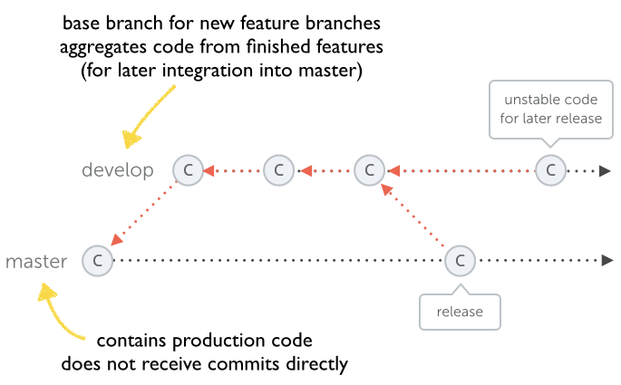
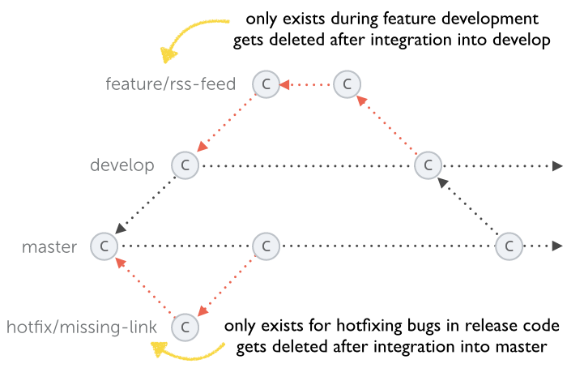

# Git 分支策略

上面的图片，完整地体现了 Git Flow 的分支策略。下面的所有内容，将以这张图片展开。

## The main branches

在一个项目中，有两个主要的分支，会一直存在于项目整个开发的生命周期中：

1. master 分支
1. develop 分支

### master branch

master 分支上的代码应该是随时能够用于进行打包上线的代码，这就要求 master 分支上的代码必须是稳定的，我们的所有开发工作都不应该直接在 master 分支上进行。

### develop branch

develop 分支是所有新功能开发的基础分支，当我们需要添加一个新的 feature 的时候，应该基于 develop 分支创建一个新的 feature 分支。待 feature 开发完毕之后会合并到 develop 分支上，等待着以某种方式被合并到 master 分支上。因此 develop 分支其实起到了汇总所有已完成 feature 的作用，所以有的人也会叫 develop 分支为 integration branch。

需要注意的是，develop 分支只应该用于汇总已完成的 feature，其代码的稳定性虽然不及 master 分支，但仍然要有较高的稳定性，因此并不适合直接在 develop 分支上直接进行开发。

当 develop 积累了一定的新 features，代码处于稳定的状态并且可用于发布版本的时候，所有的更改将会以某种方式合并到 master 分支。

另外 develop 分支的代码适用于 nightly builds。

## Supporting branches

前面的介绍中，已经了解到 master 分支以及 develop 分支并不适合直接在上面进行开发，因此我们需要不同类型的 supporting branches 去让我们的团队成员能够并行开发、跟踪 features、发布版本以及快速修复已上线版本的 bug。

master 以及 develop 分支由于在整个项目开发生命周期都存在，因此它们可以称之为长期分支。而其它 suporting branches，如 feature、release 分支等只会短暂存在，它们按需创建，并且在完成了任务之后被删除。

常用到的 supporting branches 类型有：

- Feature branches
- Release branches
- Hotfix branches

每一个类型的 supporting branch 用于什么用途，哪一个分支是它们的 originating branch 以及这些 supporting branchs 最终要合并到哪个分支都是有严格的规定的。

### Feature branch

- 分支来源：develop
- 分支合并目标分支：develop
- 分支命名惯例：`feature-*`、`feature/*`

使用单独的分支用于功能开发，是版本管理中一个很重要的原则。

当需要开发一个新的功能时，应基于 develop 分支创建新的 feature 分支。当开发完毕之后，就可以将 feature 分支合并到 develop 分支中。合并完毕之后，就可以将 feature 分支删除。

通常 feature branch 只存在于开发者的本地仓库中，而不是远端仓库。

### Release branch

- 分支来源：develop
- 分支合并目标分支：develop 和 master
- 分支命名惯例：`release-*`、`release/*`

Release branch 用于准备新版本的发布，它基于 develop branch 创建。发布分支允许 minor bug fixes （次要 Bug 修复），以及更改与发布版本相关信息，如版本号的更改。

#### Creating a release branch

那么如何判断什么时候需要从 develop branch 中创建 release branch 呢？当 develop branch 中包含这次 release 的所有 feature 的时候就可以创建 release branch 了。

在创建 release branch 的时候，就可以给这个 release 分配版本号了。在创建 release 分支之前，针对 develop 的更改，版本号是分配 0.3 还是 1.0 其实并不是很明确。当创建完 release 分支之后，我们根据里面所包含的 feature 就能比较明确需要分配的版本号了。

当 release branch 创建完毕之后，develop 分支可以继续整合下一次 release 的 feature 了。由于创建 release 的时候就已经确定了这次发布版本的内容，这时候我们可以无需担心 develop 分支整合下一次 release 的 feature 会影响到这个 release 的内容。

#### Finishing a release branch

Release 分支会在版本正式发布的时候被删除。

在这之前，我们可以对 release 分支进行 bug 修复，但是需要注意的是，绝对不能向 release 分支提交新的 feature，因为添加新 feature 那是 feature 分支做的事情。

当确定当前 release 分支的内容可用于版本的正式发布的时候，我们就可以将 release 分支向 develop 分支以及 master 分支进行合并了。合并完之后，就可以对 master 分支打 tag，tag 以版本号命名。

做完前面的工作之后，就可以将 release 分支移除了。

### Hotfix branches

- 分支来源：master
- 分支合并目标分支：develop 和 master
- 分支命名惯例：`hotfix-*`、`hotfix/*`

当已经正式发布的版本出现了需要紧急修复的 bug 的时候，则可以从 master 分支创建 hotfix 分支去修复这个 bug。

hotfix 完毕之后，有几样东西需要做：

1. 更改版本号：例如出 bug 的版本为 1.2.0，当修复完 bug 之后，就应该将版本号提升为 1.2.1。
2. 将 hotfix 分支向 master 分支并打 tag。
3. 将 hotfix 分支向 develop 分支进行合并。
4. 移除 hotfix 分支。

有一点需要注意的是，如果进行 hotfix 的时候，已经存在 release 分支了，就应该将 hotfix 分支合并到 release 分支而不是 develop 分支。因为最终 release 分支是要合并到 develop 分支的。

## 参考资料

- [Workflows with git-flow](https://www.git-tower.com/learn/git/ebook/en/command-line/advanced-topics/git-flow)
- [A successful Git branching model](https://nvie.com/posts/a-successful-git-branching-model/)
- [gitflow-avh](https://github.com/petervanderdoes/gitflow-avh)
