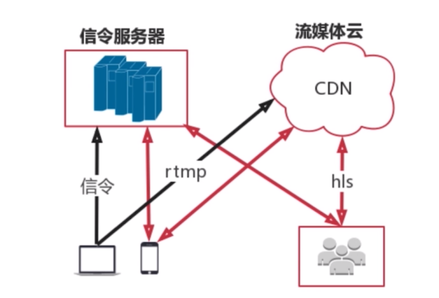
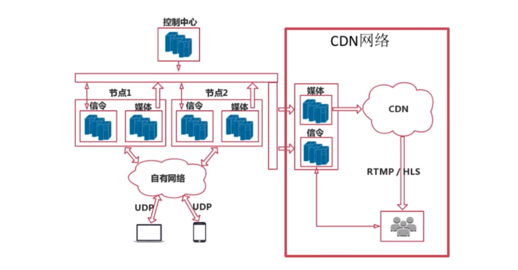

# 万人直播架构

## 直播产品的种类

- 泛娱乐化直播：花椒、映客等娱乐直播，还有斗鱼、熊猫等游戏直播。
- 实时互动直播：音视频会议、教育直播等，像思科、全时、声网。

## 泛娱乐化直播架构

泛娱乐化直播架构，主要有以下四部分组成：

- 第一部分： **共享端** ，也就是我们熟知的主播端。它发起信令到 **信令服务器** 。
- 第二部分：**信令服务器**。信令服务器接收到信令之后，就会进行相应的逻辑处理。常见如创建房间、聊天、发送礼物，这些都是以信令的格式来处理的。
- 第三部分：**流媒体云**，也就是我们熟知的 CDN 网络。它的作用就是对音视频流进行转发，它是泛娱乐化直播当中最重要的部分。
- 第四部分：**观看端**。

### 主播如何分享他的节目，观众如何收到这个节目

首先，共享端需要发一个创建房间的信令给信令服务器。当信令服务器接收到这个信令之后，就在服务端创建好这个房间。之后信令服务器会返回给共享端一个流媒体云的地址，共享端会采集自己的音视频数据，形成 rtmp 流，推送到 CDN 网络。到这里共享端的工作就已经做完了。

如果这时候有观众想观看主播的节目，客户端就会发送一个信令到信令服务器。当信令服务器接收到这个信令之后，就会将这个用户添加到主播的房间。然后信令服务器也会给观众发送主播流媒体云的地址，观众就可以到 CDN 网络拉去音视频流（hls）。

## 实时互动直播架构

实时互动直播架构比泛娱乐化直播架构会复杂得多。

实时互动直播架构图的右半部分，即 CDN 网络部分，就是前面所介绍的泛娱乐化直播架构，它包括信令部分、CDN 部分、以及共享者和观看者部分。

下面我们来分析一下架构图左半部分。

### 自由网络为什么选择 UPD 而不是 TCP

为什么实时互动直播架构会有自有网络部分，而泛娱乐化直播架构则只需要 CDN 网络？这主要与传输协议有关。网络传输时主要应用两种协议，一种是 UDP、另外议中是 TCP。

TCP 是可靠的、流式的传输协议。所谓可靠的、流式的传输协议，即所发送的数据，接收方必须是收到的，而且是有序的，它需要保证这一点。而这一点是通过发送、确认、超时、重发来确保的。

举个例子来说明一下什么是发送、确认： A 向 B 发送数据包，当 B 收到数据包之后，就会向 A 发送一个 ack 消息表明 B 已经收到消息了，A 可以继续发送数据包。这就叫做发送、确认。

下面来解释一下什么是超时、重发：A 给 B 发送消息，消息丢了，B 无法向 A 返回确认消息。A 会等待一段超时时间，如果超过超时时间，A 就认为这个包丢了，然后重新向 B 再发送一次相同的数据。如此反复，A 可以等待三次的超时时间，而且每次的超时时间，都是成倍增加的。按照 TCP 这个协议，为了发送的包能够安全到达，并且是有序到达。因此如果网络不好的话，等待时间就会非常长。

由于这样一个机制，我们就可以判定 TCP 是没法达到实时传输的效果的。因此我们需要使用 UDP 网络。

UPD 传输的特点：A 向 B 发包，A 有包就发，不管 B 有没有收到。UPD 的这个特点，以及我们音视频的数据是有时效性的原因，因此我们就可以使用 UPD 来达到音视频实时互动的需求。但是由于 UPD 不像 TCP 那样有现成的 CDN 网络，因此需要我们去搭建自有网络。

### 为什么需要多个节点

另外由于业务上的需求，在服务端会有多个节点。举个例子来说明一下为啥需要需要多个节点，例如我们在开视频会议，视频会议是 To B 的产品，因此就需要产品可靠，24小时都能服务。一但某个节点出现了问题，那么就可以快速将这个节点的所有业务都切换到另外一个节点上，继续为用户提供服务。而对于用户来说，他是无感知的，因为服务一直是通畅的。另外有多个节点，还能实现每个节点的负载均衡，降低风险。
